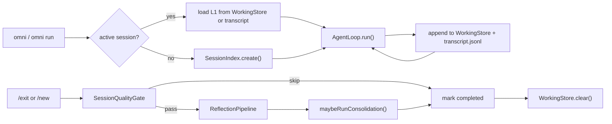
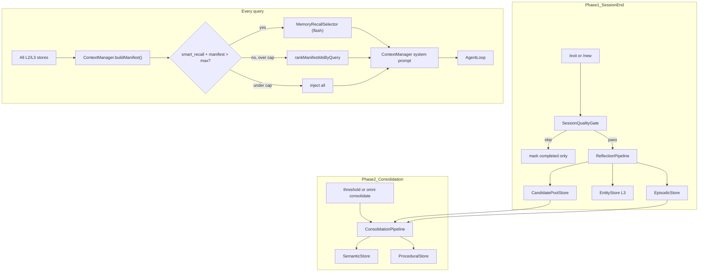
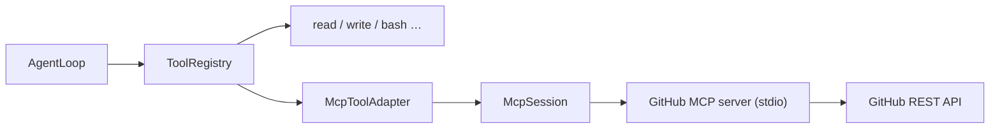

# OmniCode Architecture

## Overview

OmniCode is a terminal-native agentic coding CLI. It uses Alibaba Qwen (DashScope) via the OpenAI-compatible API.

Core capabilities:

- **Agentic loop** — streaming LLM + function calling with permission-gated destructive tools
- **Multi-agent orchestration** — Conductor dispatches specialist sub-agents (planner, explorer, coder, reviewer, verifier)
- **Session persistence** — JSONL transcript + project-scoped session index
- **Three-tier memory** — L1 working, L2 episodic/semantic/procedural, L3 entity
- **Two-phase L2 promotion** — Reflection at session end, Consolidation across episodes
- **Smart recall** — LLM side-query selects relevant memories from a full manifest
- **MCP external tools** — GitHub API via Model Context Protocol (stdio), bridged into the existing `Tool` registry

## Layers

```
CLI (Commander + readline REPL)
  → SessionEngine (session lifecycle, transcript, reflection, consolidation)
    → McpManager (stdio MCP servers → dynamic tools)
    → AgentLoop (core while-loop: LLM → tools → LLM)
      → Tools (read, write, edit, bash, grep, glob, ask_user, dispatch)
      → MCP tools (mcp__{server}__{tool}, e.g. mcp__github__search_issues)
      → AgentRouter (sub-agent dispatch → HandoffReport)
    → ContextManager (system prompt + OMNI.md + smart memory recall)
      → MemoryRecallSelector (flash side-query over manifest)
    → Memory stores (L1 working, L2 episodic/semantic/procedural, L3 entity)
    → QwenProvider (streaming + tool call aggregation)
    → ModelRouter (per-agent model selection from omni.config.yaml)
```

## Key Files

| Path | Responsibility |
|------|----------------|
| `src/cli/index.ts` | Commander entry: `chat`, `run`, `sessions`, `consolidate`, `mcp` |
| `src/mcp/McpManager.ts` | Start MCP servers, collect tools, lifecycle |
| `src/mcp/McpSession.ts` | Single stdio MCP client (`@modelcontextprotocol/sdk`) |
| `src/mcp/McpToolAdapter.ts` | MCP tool → OmniCode `Tool`; namespaced as `mcp__{server}__{tool}` |
| `src/mcp/build-agent-registry.ts` | Merge builtin + MCP tools per agent profile |
| `src/cli/repl.ts` | Interactive REPL + slash commands |
| `src/engine/AgentLoop.ts` | Core agentic loop (LLM ↔ tools) |
| `src/engine/SessionEngine.ts` | Session orchestration, L1 persistence, reflection/consolidation triggers |
| `src/engine/ContextManager.ts` | System prompt assembly: OMNI.md + memory manifest + recall selection |
| `src/llm/qwen-provider.ts` | DashScope / Qwen integration |
| `src/llm/model-router.ts` | Map agent role → model name |
| `src/llm/tool-call-accumulator.ts` | Aggregate streaming `tool_calls` chunks |
| `src/orchestrator/AgentRouter.ts` | Sub-agent dispatch (sync only) |
| `src/orchestrator/HandoffBus.ts` | HandoffReport collector (reserved; not wired yet) |
| `src/memory/ReflectionPipeline.ts` | Phase 1: post-session extraction |
| `src/memory/ConsolidationPipeline.ts` | Phase 2: cross-episode promotion |
| `src/memory/CandidatePoolStore.ts` | Pending semantic/procedural candidates |
| `src/memory/MemoryRecallSelector.ts` | Smart recall via flash side-query |
| `src/memory/recall-utils.ts` | Keyword ranking fallback, drift defense, recallHint guidelines |
| `src/memory/session-quality.ts` | Skip trivial sessions before reflection |
| `src/session/SessionIndex.ts` | Session metadata index (project-scoped) |
| `src/session/TranscriptStore.ts` | JSONL chat transcript per session |
| `src/config/load-config.ts` | Multi-path config resolution |

## Agent Profiles

Each agent has a dedicated model and tool set defined in `omni.config.yaml`:

| Agent | Model (default) | Tools | Role |
|-------|-----------------|-------|------|
| conductor | qwen-plus | read, grep, glob, dispatch, ask_user + MCP (if enabled) | Orchestrates work, delegates to specialists |
| planner | qwen-plus | read, grep, glob | Read-only planning |
| explorer | qwen-flash | read, grep, glob | Read-only codebase exploration |
| coder | qwen3-coder-plus | read, write, edit, bash, grep, glob | Implementation |
| reviewer | qwen-plus | read, grep, glob | Read-only code review |
| verifier | qwen-flash | read, bash | Run tests / verify changes |

Reflection and consolidation use the `reflection` model (default: qwen-flash).

## Session Lifecycle



- REPL auto-resumes the most recent **active** session for the current project.
- `omni run --session <id>` resumes a specific session in single-shot mode.
- `/new` ends the current session (reflection + optional consolidation) and starts fresh on the next query.

## Memory Flow (Two-Phase)



| Layer | Phase 1 (session end) | Phase 2 (consolidation) | Recall |
|-------|----------------------|-------------------------|--------|
| L1 Working | maintained during session, cleared on end | — | injected into AgentLoop messages |
| L2 Episodic | direct write | input to consolidation | ContextManager (manifest + selection) |
| L2 Semantic | candidate pool | promoted write | ContextManager (manifest + selection) |
| L2 Procedural | candidate pool | promoted write | ContextManager (manifest + selection) |
| L3 Entity | direct write | — | ContextManager (manifest + selection) |

### Recall selection

1. Load all memories for the project; build a lightweight **manifest** (`id`, `type`, `recallHint`, `summary`).
2. If manifest size ≤ `recall_max_total` (default 5), inject everything.
3. If over cap and `smart_recall: true` (default), call `MemoryRecallSelector` with the user query and reflection model.
4. On LLM failure, fall back to keyword scoring over `recallHint` + `summary`.
5. Inject selected items into the system prompt with a **memory drift defense** block (verify paths/symbols with tools before acting).

Each memory item carries a `recallHint` — search keywords for future retrieval, written during Reflection/Consolidation.

## Sub-Agent Dispatch

```
Conductor calls dispatch(agent, task)
  → AgentRouter.dispatch() [sync only]
    → new AgentLoop with agent-specific tools + model
    → returns HandoffReport JSON as tool_result
```

- `run_mode: async` is declared but returns `status: blocked` (not implemented).
- Sub-agent `write` / `edit` / `bash` also require user confirmation in REPL.
- `HandoffBus` exists for future trace/debug but is not wired into `AgentRouter` yet.

## MCP (External Tools)

OmniCode extends the agent beyond the local filesystem via [Model Context Protocol](https://modelcontextprotocol.io). MCP servers run as child processes (stdio); their tools are adapted at runtime into the same `Tool` interface used by builtin tools. **AgentLoop is unchanged.**



### Startup flow

```
SessionEngine.query()
  → McpManager.connect()          # once per process
  → spawn MCP server (stdio)
  → listTools() from each server
  → McpToolAdapter → Tool[]
  → buildAgentToolRegistry(agentId)  # merge with builtin tools
  → AgentLoop.run()
```

- Connection is lazy and cached on `SessionEngine`; REPL exit calls `engine.close()` to tear down MCP child processes.
- If a server fails to start (missing token, spawn error), OmniCode logs a warning and continues with builtin tools only.

### Tool naming and permissions

| Concern | Behavior |
|---------|----------|
| Naming | `mcp__{serverId}__{originalToolName}` avoids collisions with builtin tools |
| Agent scope | `mcp.servers.{id}.agents` controls which agents receive that server's tools (default: all) |
| Tool whitelist | `mcp.servers.{id}.tools` limits exposed MCP tools (default: all from server) |
| Destructive ops | `create_*`, `merge_*`, etc. marked `isDestructive`; subject to permission ask like `write`/`bash` |
| Env vars | `${GITHUB_TOKEN}` in config expanded from `process.env`; empty values do not override shell env |

### Default GitHub MCP tools (read-only demo)

When `mcp.enabled: true` and `GITHUB_TOKEN` (or `GITHUB_PERSONAL_ACCESS_TOKEN`) is set:

- `mcp__github__search_issues`, `search_code`, `search_repositories`, `search_users`
- `mcp__github__list_issues`, `get_issue`, `list_pull_requests`, `get_pull_request`, `get_pull_request_files`
- `mcp__github__get_file_contents`, `list_commits`

Write tools (create issue, merge PR, push files) can be added to the `tools` whitelist; they still require user confirmation in REPL ask mode.

## Data Layout

```
~/.omni/
├── sessions/
│   ├── index.json
│   └── {sessionId}/transcript.jsonl
├── episodes/{projectHash}/{sessionId}.json
├── semantic/{projectHash}/facts.jsonl
├── procedures/{projectHash}/procedures.jsonl
├── entities/{projectHash}/facts.jsonl
└── candidates/{projectHash}/
    ├── pool.jsonl
    └── state.json
```

Project root may also contain `OMNI.md` (human-editable project memory, injected into every system prompt).

## Configuration

Resolved in order:

1. Explicit path argument
2. `OMNI_CONFIG` environment variable
3. `./omni.config.yaml` (current project)
4. `~/.omni/config.yaml` (user global)
5. Package-bundled `omni.config.yaml` (default)

Key settings in `omni.config.yaml`:

```yaml
memory:
  reflection_confidence_threshold: 0.7
  smart_recall: true          # flash side-query for recall selection
  recall_max_total: 5         # max memories injected per query (all types combined)
  consolidation:
    auto: true
    min_pending_semantic: 3
    min_pending_procedural: 2
    min_episodes_since_last: 5

mcp:
  enabled: true
  servers:
    github:
      command: node
      env:
        GITHUB_PERSONAL_ACCESS_TOKEN: "${GITHUB_TOKEN}"
      agents: [conductor]
      tools: [search_issues, list_pull_requests, ...]  # optional whitelist
      destructive: [create_issue, merge_pull_request, ...]
```

Set `GITHUB_TOKEN` in the shell or `~/.omni/env`. Fine-grained PAT with **Public repositories (read-only)** is sufficient for the default tool set.

## Commands

```bash
omni                  # Interactive REPL (default)
omni chat             # Same as above
omni run "..."        # Single-shot mode
omni run "..." --session <id>   # Resume a session
omni sessions         # List sessions for current project
omni consolidate      # Force memory consolidation for current project
omni mcp              # List MCP tools loaded from config
```

All commands accept `-c, --cwd <path>` to set the working directory.

REPL slash commands: `/sessions`, `/new`, `/exit`
