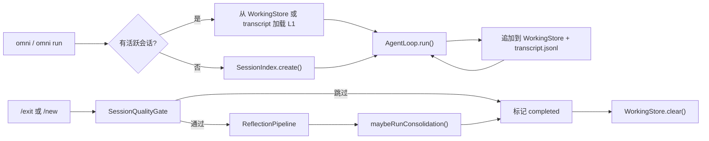
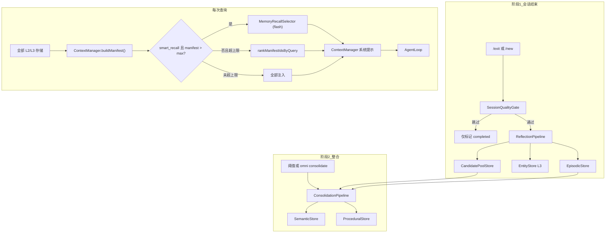
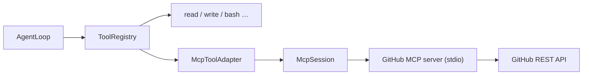

# OmniCode 架构

## 概览

OmniCode 是面向终端的智能体编程 CLI，通过 OpenAI 兼容 API 使用阿里通义千问（DashScope）。

核心能力：

- **智能体循环** — 流式 LLM + 函数调用，对破坏性工具进行权限门控
- **多智能体编排** — Conductor 委派给专业子智能体（planner、explorer、coder、reviewer、verifier）
- **会话持久化** — JSONL 对话记录 + 项目级会话索引
- **三层记忆** — L1 工作记忆，L2 情节/语义/程序性，L3 实体
- **L2 两阶段晋升** — 会话结束时反思，跨情节整合
- **智能召回** — LLM 侧查询从完整清单中选取相关记忆
- **MCP 外部工具** — 通过 Model Context Protocol（stdio）接入 GitHub API，桥接到现有 `Tool` 注册表

## 分层结构

```
CLI（Commander + readline REPL）
  → SessionEngine（会话生命周期、对话记录、反思、整合）
    → McpManager（stdio MCP 服务器 → 动态工具）
    → AgentLoop（核心 while 循环：LLM → 工具 → LLM）
      → Tools（read、write、edit、bash、grep、glob、ask_user、dispatch）
      → MCP 工具（mcp__{server}__{tool}，如 mcp__github__search_issues）
      → AgentRouter（子智能体派发 → HandoffReport）
    → ContextManager（系统提示 + OMNI.md + 智能记忆召回）
      → MemoryRecallSelector（对清单的 flash 侧查询）
    → 记忆存储（L1 工作、L2 情节/语义/程序性、L3 实体）
    → QwenProvider（流式 + 工具调用聚合）
    → ModelRouter（按 omni.config.yaml 为各智能体选模型）
```

## 关键文件

| 路径 | 职责 |
|------|------|
| `src/cli/index.ts` | Commander 入口：`chat`、`run`、`sessions`、`consolidate`、`mcp` |
| `src/mcp/McpManager.ts` | 启动 MCP 服务器、收集工具、生命周期 |
| `src/mcp/McpSession.ts` | 单个 stdio MCP 客户端（`@modelcontextprotocol/sdk`） |
| `src/mcp/McpToolAdapter.ts` | MCP 工具 → OmniCode `Tool`；命名空间为 `mcp__{server}__{tool}` |
| `src/mcp/build-agent-registry.ts` | 按智能体配置合并内置 + MCP 工具 |
| `src/cli/repl.ts` | 交互式 REPL + 斜杠命令 |
| `src/engine/AgentLoop.ts` | 核心智能体循环（LLM ↔ 工具） |
| `src/engine/SessionEngine.ts` | 会话编排、L1 持久化、反思/整合触发 |
| `src/engine/ContextManager.ts` | 系统提示组装：OMNI.md + 记忆清单 + 召回选择 |
| `src/llm/qwen-provider.ts` | DashScope / Qwen 集成 |
| `src/llm/model-router.ts` | 智能体角色 → 模型名映射 |
| `src/llm/tool-call-accumulator.ts` | 聚合流式 `tool_calls` 分片 |
| `src/orchestrator/AgentRouter.ts` | 子智能体派发（仅同步） |
| `src/orchestrator/HandoffBus.ts` | HandoffReport 收集器（预留；尚未接线） |
| `src/memory/ReflectionPipeline.ts` | 阶段 1：会话后抽取 |
| `src/memory/ConsolidationPipeline.ts` | 阶段 2：跨情节晋升 |
| `src/memory/CandidatePoolStore.ts` | 待处理语义/程序性候选 |
| `src/memory/MemoryRecallSelector.ts` | 通过 flash 侧查询的智能召回 |
| `src/memory/recall-utils.ts` | 关键词排序后备、漂移防护、recallHint 指南 |
| `src/memory/session-quality.ts` | 反思前跳过琐碎会话 |
| `src/session/SessionIndex.ts` | 会话元数据索引（项目级） |
| `src/session/TranscriptStore.ts` | 每会话 JSONL 聊天记录 |
| `src/config/load-config.ts` | 多路径配置解析 |

## 智能体配置

各智能体在 `omni.config.yaml` 中有独立模型与工具集：

| 智能体 | 模型（默认） | 工具 | 角色 |
|--------|--------------|------|------|
| conductor | qwen-plus | read、grep、glob、dispatch、ask_user + MCP（若启用） | 编排工作，委派给专家 |
| planner | qwen-plus | read、grep、glob | 只读规划 |
| explorer | qwen-flash | read、grep、glob | 只读代码库探索 |
| coder | qwen3-coder-plus | read、write、edit、bash、grep、glob | 实现 |
| reviewer | qwen-plus | read、grep、glob | 只读代码审查 |
| verifier | qwen-flash | read、bash | 运行测试 / 验证变更 |

反思与整合使用 `reflection` 模型（默认：qwen-flash）。

## 会话生命周期



- REPL 自动恢复当前项目最近一条 **active** 会话。
- `omni run --session <id>` 在单次模式下恢复指定会话。
- `/new` 结束当前会话（反思 + 可选整合），下次查询时开启新会话。

## 记忆流（两阶段）



| 层级 | 阶段 1（会话结束） | 阶段 2（整合） | 召回 |
|------|-------------------|----------------|------|
| L1 工作记忆 | 会话中维护，结束时清空 | — | 注入 AgentLoop 消息 |
| L2 情节 | 直接写入 | 整合输入 | ContextManager（清单 + 选择） |
| L2 语义 | 候选池 | 晋升写入 | ContextManager（清单 + 选择） |
| L2 程序性 | 候选池 | 晋升写入 | ContextManager（清单 + 选择） |
| L3 实体 | 直接写入 | — | ContextManager（清单 + 选择） |

### 召回选择

1. 加载项目全部记忆；构建轻量 **清单**（`id`、`type`、`recallHint`、`summary`）。
2. 若清单大小 ≤ `recall_max_total`（默认 5），全部注入。
3. 若超上限且 `smart_recall: true`（默认），用用户查询与 reflection 模型调用 `MemoryRecallSelector`。
4. LLM 失败时，对 `recallHint` + `summary` 做关键词打分后备。
5. 将选中项注入系统提示，并附带 **记忆漂移防护** 块（行动前用工具核实路径/符号）。

每条记忆带有 `recallHint` — 供未来检索的搜索关键词，在反思/整合时写入。

## 子智能体派发

```
Conductor 调用 dispatch(agent, task)
  → AgentRouter.dispatch() [仅同步]
    → 使用智能体专属工具 + 模型新建 AgentLoop
    → 以 HandoffReport JSON 作为 tool_result 返回
```

- `run_mode: async` 已声明但返回 `status: blocked`（未实现）。
- 子智能体的 `write` / `edit` / `bash` 在 REPL 中同样需要用户确认。
- `HandoffBus` 供未来追踪/调试，尚未接入 `AgentRouter`。

## MCP（外部工具）

OmniCode 通过 [Model Context Protocol](https://modelcontextprotocol.io) 将智能体能力扩展到本地文件系统之外。MCP 服务器以子进程（stdio）运行；其工具在运行时适配为与内置工具相同的 `Tool` 接口。**AgentLoop 不变。**



### 启动流程

```
SessionEngine.query()
  → McpManager.connect()          # 每进程一次
  → spawn MCP server (stdio)
  → 从各服务器 listTools()
  → McpToolAdapter → Tool[]
  → buildAgentToolRegistry(agentId)  # 与内置工具合并
  → AgentLoop.run()
```

- 连接惰性缓存于 `SessionEngine`；REPL 退出时 `engine.close()` 销毁 MCP 子进程。
- 若服务器启动失败（缺令牌、spawn 错误），OmniCode 记录警告并仅继续内置工具。

### 工具命名与权限

| 关注点 | 行为 |
|--------|------|
| 命名 | `mcp__{serverId}__{originalToolName}` 避免与内置工具冲突 |
| 智能体范围 | `mcp.servers.{id}.agents` 控制哪些智能体获得该服务器工具（默认：全部） |
| 工具白名单 | `mcp.servers.{id}.tools` 限制暴露的 MCP 工具（默认：服务器全部） |
| 破坏性操作 | `create_*`、`merge_*` 等标记 `isDestructive`；与 `write`/`bash` 一样受权限询问约束 |
| 环境变量 | 配置中 `${GITHUB_TOKEN}` 从 `process.env` 展开；空值不覆盖 shell 环境 |

### 默认 GitHub MCP 工具（只读演示）

当 `mcp.enabled: true` 且设置了 `GITHUB_TOKEN`（或 `GITHUB_PERSONAL_ACCESS_TOKEN`）时：

- `mcp__github__search_issues`、`search_code`、`search_repositories`、`search_users`
- `mcp__github__list_issues`、`get_issue`、`list_pull_requests`、`get_pull_request`、`get_pull_request_files`
- `mcp__github__get_file_contents`、`list_commits`

写工具（创建 issue、合并 PR、推送文件）可加入 `tools` 白名单；在 REPL 询问模式下仍须用户确认。

## 数据布局

```
~/.omni/
├── sessions/
│   ├── index.json
│   └── {sessionId}/transcript.jsonl
├── episodes/{projectHash}/{sessionId}.json
├── semantic/{projectHash}/facts.jsonl
├── procedures/{projectHash}/procedures.jsonl
├── entities/{projectHash}/facts.jsonl
└── candidates/{projectHash}/
    ├── pool.jsonl
    └── state.json
```

项目根还可包含 `OMNI.md`（可人工编辑的项目记忆，注入每次系统提示）。

## 配置

按以下顺序解析：

1. 显式路径参数
2. `OMNI_CONFIG` 环境变量
3. `./omni.config.yaml`（当前项目）
4. `~/.omni/config.yaml`（用户全局）
5. 包内捆绑的 `omni.config.yaml`（默认）

`omni.config.yaml` 中的关键设置：

```yaml
memory:
  reflection_confidence_threshold: 0.7
  smart_recall: true          # flash 侧查询用于召回选择
  recall_max_total: 5         # 每次查询最多注入的记忆条数（各类型合计）
  consolidation:
    auto: true
    min_pending_semantic: 3
    min_pending_procedural: 2
    min_episodes_since_last: 5

mcp:
  enabled: true
  servers:
    github:
      command: node
      env:
        GITHUB_PERSONAL_ACCESS_TOKEN: "${GITHUB_TOKEN}"
      agents: [conductor]
      tools: [search_issues, list_pull_requests, ...]  # 可选白名单
      destructive: [create_issue, merge_pull_request, ...]
```

在 shell 或 `~/.omni/env` 中设置 `GITHUB_TOKEN`。细粒度 PAT 具备 **公共仓库（只读）** 权限即可满足默认工具集。

## 命令

```bash
omni                  # 交互式 REPL（默认）
omni chat             # 同上
omni run "..."        # 单次执行模式
omni run "..." --session <id>   # 恢复会话
omni sessions         # 列出当前项目的会话
omni consolidate      # 强制对当前项目做记忆整合
omni mcp              # 列出配置加载的 MCP 工具
```

所有命令支持 `-c, --cwd <path>` 设置工作目录。

REPL 斜杠命令：`/sessions`、`/new`、`/exit`
